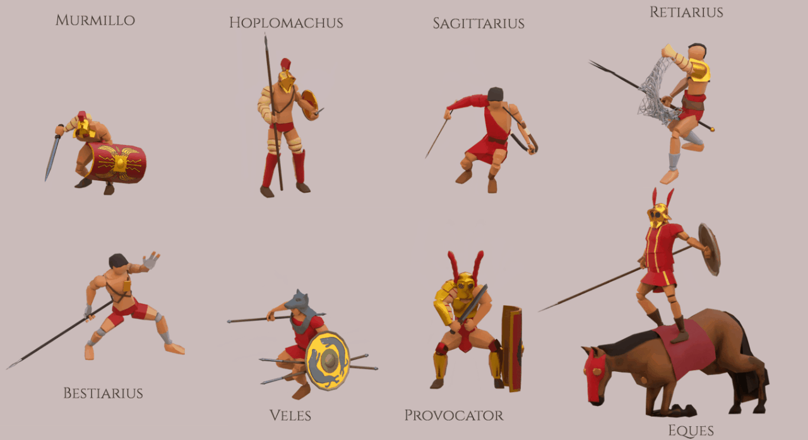
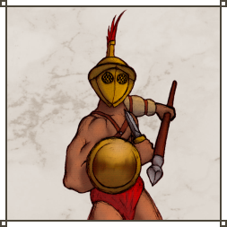
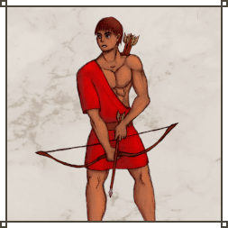
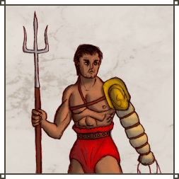

# Circus Maximus 2020

Game by  **Niklaus Houska**, **Alain Hostettler**, **Christian Scherer** and **Maximilian Wolfertz** 

## Table of Contents
* [About](#about)
* [Game Description](#game-description)
* [Content](#content)
  * [Fighters](#fighters)
  * [Animals](#animals)
  * [Cheering System](#cheering-system)
  * [Fame and Upgrades](#fame-and-upgrades)
  * [Map](#map)
  * [Sound Effects and Music](sound-effects-and-music)
  * [2D Art](#2d-art)
* [Technical Achievements](#technical-achievements)
  * [UI](#ui)
  * [Pseudo 2D](#pseudo-2d)
    * [Render Pipeline](#render-pipeline)
    * [Depth](#depth)
  * [Navigation](#navigation)
    * [Group Movement](group-movement)
    * [Collision](#collision)
    * [Pathing](#pathing)

## About
This page contains information and executables for the Circus Maximus game released for the [Game Programming Laboratory 2020](https://gtc.inf.ethz.ch/education/game-programming-laboratory/previous-years/2020.html) at ETH Zurich. The game won the Audience Choice Award.

| Information |  |
| ---:         |          :----- |
| Developers | **Niklaus Houska**: Game mechanics, Code, 3D Artwork    **Alain Hostettler**: Code Lead, UI   **Christian Scherer**: Code, Sound effects, Controls   **Maximilian Wolfertz**: Graphics, 2D Artwork |
| Platforms | Xbox, Windows |
| Release Date | May 26, 2020 |
| Genre | Real-time strategy |
| Player Count | 2 |
| Playtime per Match | 10-30 minutes |
| Development time  | ~3 months    |
| Framework | [Monogame](https://www.monogame.net/) |

## Game Description
Circus Maximus is a competitive multiplayer real-time strategy game for 2 players in pseudo-3D. Each player starts by assembling an army consisting of up to 5 groups with fighters of various categories. The goal is to crush the opponent’s army in the following battle. During combat, new fighters, upgrades and animals can be bought with a currency called cheering points, earned by the audience’s approval.

#### Trailer

## Content

### Fighters

The game features 8 unique fighters inspired by historic gladiator classes. Other fighters differ in attack, defense, HP, range, cost, movement and attack speed, as well as in unique capabilities and upgrades. 

#### Formations

 

Fighters are organised in groups of which a player can control up to 5 at the same time. Each group can be put in offensive, defensive or retreat stance which influences the fighters default behaviour. Depending on class, the defensive stance buffs defense stats on cost of movement speed. 

#### Let's Introduce our Fighters

 
 
 

**Murmillo**: An elite gladiator, excelling both in offense and defense! His speciality is a impenetrable Testudo formation.

**Hoplomachus**: Hoplomachi are mobile spearmen, that form a phalanx to repulse cavalry!

**Sagittarius**: Skillfull archers, raining hell on any enemy from distance!

**Eques** Fast and formidable fighters on horseback! Equites engage the enemy with a powerful charge attack. 

 
 
 

**Veles**: Disposable and swift - these skirmishers effectively counter archers and the unportected!

**Retiarius**: Retiarii entrap enemies with their nets leaving them incapacitated and vulnerable to attacks. 

**Provocator**: Always an audience favorite, these fighters trade attack for suvivability and know how to get the crowd going. 

**Bestiarius**: Light footed and fearless. Bestiarii excel in dominating the wild beast of the arena!

### Animals

 

## Technical Achievements
